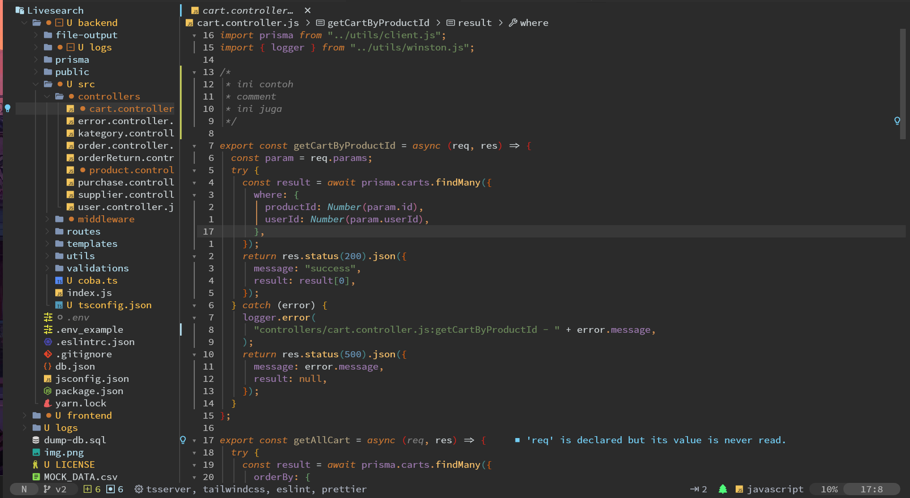

# 🧛🏻‍♂️ Darcula Dark for Neovim

The Darcula Dark theme is a Neovim colorscheme that's designed to emulate the popular Darcula color scheme from JetBrains' GoLand IDE. It is ideal for long hours of coding, offering a dark theme that's easy on the eyes. Despite trying various alternatives in Neovim, we found nothing quite matched up, hence we embarked on creating this color scheme ourselves.



comparing with the original Darcula theme in GoLand:


## Default Colors

```lua
{
  green = "#98be65",
  red = "#f43753",
  grey = "#C9D0D3",
  light_blue = "#b3deef",
  background = "#383838",
  pale_gold = "#d3b987",
  dark = "#2B2B2B",
  bright_sky = "#73cef4",
  golden_yellow = "#ffc24b",
  light_olive_green = "#c9d05c",
  medium_gray = "#4c4c4c",
  light_brown = "#dc9656",
  silver_gray = "#b8b8b8",
  bright_cyan = "#00f1f5",
  light_slate_gray = "#abb2bf",
  dark_grey = "#484848",
  comment = "#808080",
  light_lime_green = "#a9ff68",
  peach_orange = "#ff9e64",
  slate_gray = "#6d8086",
  light_lavender = "#cba6f7",
  very_light_gray = "#eeeeee",
  dark_charcoal_gray = "#404040",
  very_dark_gray = "#242424",
  bright_pink = "#f70067",
  burnt_orange = "#CC7832",
  dark_maroon = "#7a1b29",
  steel_blue = "#596f77",
  bright_yellow_green = "#e3e346",
  copper_brown = "#C07C41",
  deep_fuchsia = "#b33076",
  lavender = "#9876AA",
  deep_light_blue = "#51afef",
  pale_taupe = "#AD9E7D",
  olive_green = "#6A8759",
  _52 = "#c95942",
  _54 = "#bf4537",
  _64 = "#89d957",
  _70 = "#4dd158",
  _66 = "#6FAFBD",
  _71 = "#4B4E4F",
  _74 = "#3C3F40",
  _38 = "#881515",
  _39 = "#73797e",
  _47 = "#f7bb3b",
  _50 = "#d1d4cf",
  _53 = "#c955ae",
  _55 = "#b8733e",
  _56 = "#afd700",
  _57 = "#ad475f",
  _58 = "#FFC66D",
  _61 = "#AFBF7E",
  _68 = "#6897BB",
  _72 = "#4682b4",
  _75 = "#392a52",
  _82 = "#151838",
}
```

## Installation

To install this color scheme, add the following to your plugin configuration:

lazy.nvim

```lua
  {
    "pojokcodeid/darcula-dark.nvim",
    priority = 1000,
    lazy = false,
    config = function()
      require("darcula").setup {
        -- overide default colors
        colors = {
          lavender = "#9876AA",
        },
      }
      vim.api.nvim_create_autocmd("ColorScheme", {
        pattern = "*",
        callback = function()
          -- get colors
          local colors = require("darcula").colors()
          -- custom hilights
          local hi = vim.api.nvim_set_hl
          hi(0, "@property.json", { fg = colors.lavender })
        end,
      })
    end,
  },
```

packer.nvim

```lua
  use {
    'pojokcodeid/darcula-dark.nvim',
    requires = {"nvim-treesitter/nvim-treesitter"}
  }

```

## Note

For transparent background

- https://github.com/xiyaowong/transparent.nvim

## TODO

- [ ] support Darcula Solid Theme https://plugins.jetbrains.com/plugin/13920-darcula-solid-theme
- [ ] support more plugins

## Supported Plugins

- telescope
- Treesitter
- cmp-nvim
- copilot.vim
- dap.nvim
- eyeline.nvim
- gitsign.nvim
- hop.nvim
- nerdtree.vim
- lspsaga.nvim
- scrollbar.nvim
- lualine.nvim

## Usage

lua

```lua
vim.cmd.colorscheme("darcula-dark")

```

vimscript

```vimscript
colorscheme darcula-dark
```

## Requirements

This color scheme requires Neovim v0.8.3 or higher, as it uses LSP Semantic tokens. It also depends on nvim-treesitter/nvim-treesitter.

## Debug

make sure your true color: https://gist.github.com/andersevenrud/015e61af2fd264371032763d4ed965b6

## Alternatives

- [doums/darcula](https://github.com/doums/darcula)
- [santos-gabriel-dario/darcula-solid.nvim](https://github.com/santos-gabriel-dario/darcula-solid.nvim)

## Credits

- [Darcula Darker Theme from JetBrains](https://plugins.jetbrains.com/plugin/12692-darcula-darker-theme)
- [Neovim Plugin Template by ellisonleao](https://github.com/ellisonleao/nvim-plugin-template)
- [nvim-base16](https://github.com/RRethy/nvim-base16)
